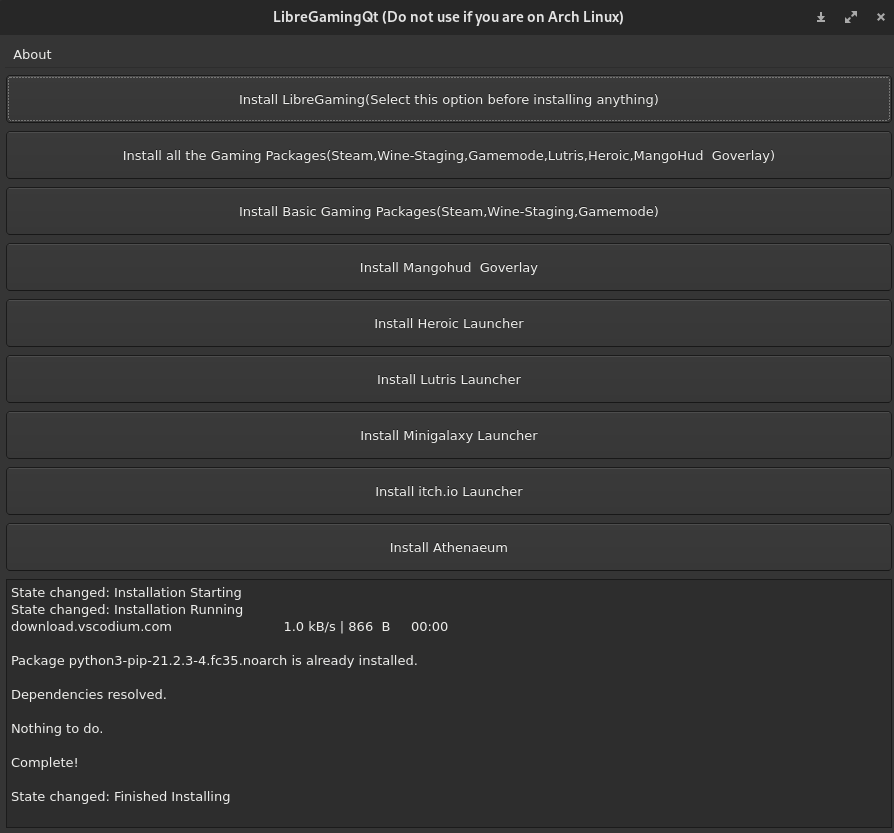
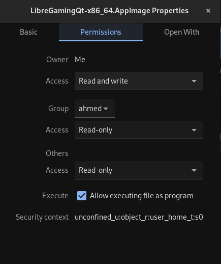

# LibreGaming
Python Program that downloads gaming required packages based on your Linux Distribution.



[](https://pepy.tech/project/libregaming)  [](https://patreon.com/user?u=42792180)

Table of contents
=================
 - [Distributions](#Distributions)
 - [Prerequisites](#Prerequisites)
     - [Dependencies](#Dependencies)
 - [Packages](#Packages)
     - [Optional Packages](#Optional_Packages)
          - [Other Packages](#Other_Packages)
 - [Installation](#Installation)
 - [Usage](#Usage)
 - [VideoDemo](#VideoDemo)
 - [Feedback](#Feedback)
 - [Credits](#Credits)
 - [للعربية](#للعربية) 

# للعربية
بسبب مشكلة إستخدام العربية في قيت_هوب قمت بعمل مقال يشرح كل تفاصيل البرنامج على [مدونتي](https://tech-ahmed.com/LibreGaming/).

# Distributions:
* I tested this script on these distributions. but it should also work on their derivatives too.
1. Ubuntu(Tested also on Linux Mint, Pop_OS!).
2. Arch Linux.
3. Fedora.
4. OpenSUSE Tumbleweed.

# Prerequisites:
* You need your drivers installed beforehand for maximum performance under Linux. you can install them by going to this [page](https://github.com/lutris/docs/blob/master/InstallingDrivers.md)

* To run this LibreGaming script you need python3 installed if not already. to install python3 click [Here](https://github.com/Ahmed-Al-Balochi/LibreGaming#dependencies).
* Also you need to enable free and nonfree packages if you are using Fedora to install steam. You can find the commands to enable free and nonfree packages for Fedora [here](https://docs.fedoraproject.org/en-US/quick-docs/setup_rpmfusion/#proc_enabling-the-rpmfusion-repositories-using-command-line-utilities_enabling-the-rpmfusion-repositories):

* For OpenSUSE Tumbleweed you need to enable packman repos to install Steam and other packages. You can find that [here](https://en.opensuse.org/Additional_package_repositories)

* If you are using Arch Linux or an Arch based system you need to enable 32bit packages found in multilib repo you can enable it by going to this [Arch wiki page](https://wiki.archlinux.org/title/official_repositories#multilib).

## Dependencies:
* git
1. Install git For Ubuntu:
```
sudo apt install git
```
2. Install git For Arch Linux:
```
sudo pacman -S git
```
3. Install git For Fedora:
```
sudo dnf install git
```
4. Install git For OpenSUSE Tumbleweed:
```
sudo zypper install git
```

* python3
1. Install Python3 For Ubuntu:
```
sudo apt install python3
```
3. Install Python3 For Arch Linux:
```
sudo pacman -S python
```
3. Install Python3 For Fedora:
```
sudo dnf install python3
```
4. Install Python3 For OpenSUSE Tumbleweed:
```
sudo zypper install python3
```

* python3-pip.
1. Install python3-pipx For Ubuntu:
```
sudo apt install pipx
```
if you're getting an error/issues with installing libregaming using pipx. Use pip
```
sudo apt install pip

```
2. Install python3-pip For Arch Linux:
```
sudo pacman -S python-pipx
```
3. Install python3-pip For Fedora:
```
sudo dnf install pipx
```
4. Install python3-pip For OpenSUSE Tumbleweed (Replace the "xxx" with the available pipx version):
```
sudo zypper install pythonxxx-pipx
```

* [Flatpak](https://flatpak.org/setup/) is needed for installing Athenaeum.

# Packages:
* These Packages are installed using ```libregaming -b ```
1. [Steam](https://store.steampowered.com/).
2. [Wine-Staging](https://www.winehq.org/).
3. [Gamemode](https://github.com/FeralInteractive/gamemode).
## Optional_Packages
* These Packages + the ones above can be installed using ```libregaming -g ```
1. [Lutris](https://github.com/lutris/lutris.git).
2. [mangohud](https://github.com/flightlessmango/MangoHud.git) and [goverlay](https://github.com/benjamimgois/goverlay.git)(Needs AUR enabled on Arch Linux).
### Other_Packages
* These Packages have their own install option and they are not included in the above packages. They need to be installed seperatly, to know more click [here](https://github.com/Ahmed-Al-Balochi/LibreGaming#usage)
2. [Athenaeum](https://gitlab.com/librebob/athenaeum.git) Launcher for FOSS games.
3. [itch.io](https://itch.io/app) a Launcher for indie games.
4. [Steam Tinker Launch](https://github.com/frostworx/steamtinkerlaunch)(Only for Arch Linux).
5. [Heroic](https://github.com/Heroic-Games-Launcher/HeroicGamesLauncher.git) (Needs AUR enabled on Arch Linux)

# Installation:
## GUI
* To use the GUI interface you need to download the ```LibreGamingQt-x86_64.AppImage``` from the [releases page](https://github.com/Ahmed-Al-Balochi/LibreGaming/releases) and give it execute privileges and run it! 



## CLI
* You can install LibreGaming using pip if you have it installed. click [Here](https://github.com/Ahmed-Al-Balochi/LibreGaming#dependencies) to install pip3:
```
sudo pipx install LibreGaming
```
* Or you can install LibreGaming script by entering these commands:
```
git clone https://github.com/Ahmed-Al-Balochi/LibreGaming.git LibreGaming/ 
cd LibreGaming/
sudo pipx install . --global
```
* To update LibreGaming when there is a new release enter this command:
```
sudo pipx install libregaming --global -U
```

* LibreGaming: command not found. 

This error can be solved by setting up the PATH in your shell.

# Usage:
* Note: you can also run this script using ```libregaming``` command if you don't like ```LibreGaming```. Both can be used, so choose what you prefer.
* To install all the Gaming packages mentioned in the packages section enter this command:
```
sudo libregaming -g
```
* To install Basic Packages(Wine, Steam, Gamemode):
```
sudo libregaming -b
```
* To install Lutris Launcher enter this command:
```
sudo libregaming --lutris 
```
* To install Heroic Launcher enter this command (Don't use sudo if you are using OpenSUSE):
```
sudo libregaming --heroic
```
* To install MangoHud & Goverlay enter this command:
```
sudo libregaming -o
```
* To install Athenaeum Launcher enter this command:
```
libregaming -ath
```
* To install itch.io Launcher enter this command:
```
libregaming --itch
```
* To install Minigalaxy Launcher enter this command:
```
libregaming --minigalaxy
```
* To install Steam Tinker Launch(For Arch Linux only) enter this command:
```
libregaming --stl
```

# VideoDemo:
* This a my video demonstrating LibreGaming in [English](https://www.youtube.com/watch?v=F9GP5Et12qo). And click here for [Arabic](https://www.youtube.com/watch?v=QI8Ai8BTMwo)
* This is a video demonstrating LibreGaming made by TechHut:
https://www.youtube.com/watch?v=2f2zdViFDYg
* This is a video demonstrating LibreGaming made by @BrodieRobertson:
https://www.youtube.com/watch?v=sOch-qZMLq0&t=309s

# Feedback:
* Tell me what distro to add if yours is not available. And what features you'd like to see.
* Also please report if there are any bugs in the script.
* Your feedback is always welcome.

# Credits:
* Thanks to [flightlessmango](https://github.com/flightlessmango/) for mangohud.
* Thanks to [benjamimgois](https://github.com/benjamimgois/) for goverlay.
* Thanks to anyone who downloads this script, and to everyone who gives me feedback.  
